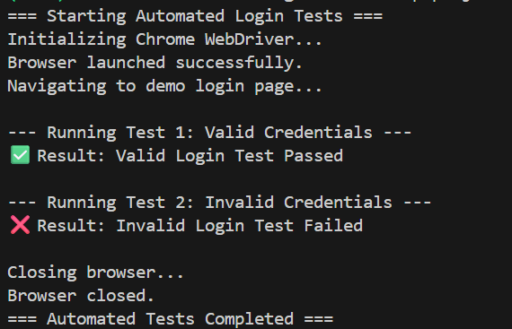

# AI in Software Engineering 

## Theme: Building Intelligent Software Solutions

### Objective

This project demonstrates how AI can automate software development tasks, enhance decision-making, and address common challenges in engineering workflows. It combines theoretical understanding, practical implementation, and ethical reflection.

---

## Theoretical Analysis

### AI-Driven Code Generation

AI-powered tools such as GitHub Copilot assist developers by suggesting complete functions and logic patterns, reducing development time and improving efficiency. These tools accelerate prototyping and help minimize syntax and logic errors. However, they can introduce issues like over-reliance, security vulnerabilities, or generation of inaccurate code if the context is misunderstood.

### Supervised vs. Unsupervised Learning in Bug Detection

Supervised learning models are trained on labeled data to predict specific outcomes such as whether a code segment contains a bug. Unsupervised learning, on the other hand, identifies hidden structures or anomalies in unlabeled data, making it useful for discovering unknown bug patterns or performance issues. A combination of both techniques can yield more robust automated debugging systems.

### Importance of Bias Mitigation in Personalization

Bias mitigation is essential when building AI systems that personalize user experiences. Without fairness constraints, models can amplify stereotypes or underrepresent certain user groups. Techniques such as reweighting, data balancing, and post-processing adjustments help ensure fairness and inclusivity.

### AIOps and Deployment Efficiency

AIOps integrates machine learning into DevOps workflows to enhance automation and predictive insights. It improves deployment efficiency by automatically detecting anomalies during builds and predicting potential system failures. For example, AI can detect failed deployments based on log patterns or dynamically allocate computing resources during traffic surges.

---

## Practical Implementation

### AI-Suggested Code (GitHub Copilot Demo)

This section compares AI-assisted code completion with a manual implementation. The task involved sorting a list of dictionaries by a specific key.

**AI-Suggested Code:**
Used Python’s built-in `sorted()` function, which is efficient and concise (O(n log n)).

**Manual Implementation:**
Implemented a Bubble Sort algorithm (O(n²)) to perform the same task manually.

**Observation:**
The AI-suggested code was faster, cleaner, and more maintainable, showcasing how AI tools can recommend optimized algorithms instantly.


---

### Automated Testing with Selenium

This section demonstrates the use of Selenium WebDriver to automate login testing for both valid and invalid credentials.

**Approach:**
The script used Chrome WebDriver to open a sample login page, test two scenarios (valid and invalid credentials), and print clear outcomes to the terminal.

**AI Role:**
AI-based testing frameworks such as Testim.io can enhance Selenium by automatically updating test scripts when UI elements change, improving test coverage and reducing maintenance.



---

### AI-Based System Monitoring Simulation

This section simulates AI-based anomaly detection for monitoring CPU usage metrics.

**Method:**
The script generates random CPU usage data and identifies anomalies using statistical thresholds (mean ± 2 * standard deviation). Colored output highlights stability or abnormal readings.

**AI Enhancement:**
In real-world systems, AI models like Isolation Forest, LSTM, or Autoencoders can predict failures or detect unusual performance patterns with higher accuracy.

**Screenshot Placeholder:**
screenshots/ai_automaion.png

---

## Ethical Reflection

AI-based models can inherit biases from training data. For example, a predictive model for resource allocation might underrepresent specific teams or regions. Tools like **IBM AI Fairness 360** can analyze datasets for bias and help adjust models through fairness-aware algorithms.

Responsible AI design ensures inclusivity, accountability, and transparency across software systems.

---

## Project Structure

```
smart-devops-ai/
│
├── code_completion.py
├── automated_testing.py
├── predictive_model.ipynb
├── requirements.txt
├── .gitignore
└── README.md
```

---

## Installation & Setup

```
python -m venv venv
source venv/bin/activate   # On Linux/Mac
venv\Scripts\activate      # On Windows
pip install -r requirements.txt
```

Run scripts individually to view outputs in terminal.

---

## Conclusion

This assignment showcases how AI transforms software engineering by automating tasks, optimizing workflows, and improving reliability. Combining theoretical understanding with practical implementation highlights the growing importance of ethical and efficient AI integration in modern development environments.
